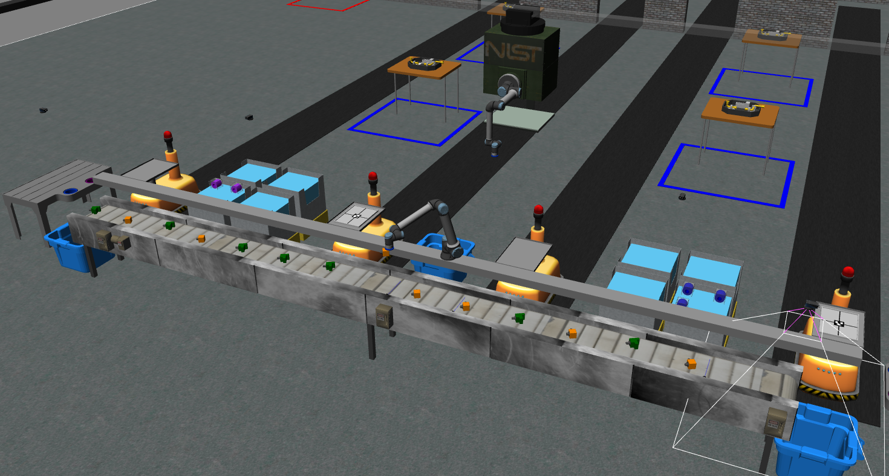

# AGILITY CHALLENGES IN A DYNAMIC MANUFACTURING ENVIRONMENT
#### CHALLENGES
```
1. Pick and place from moving conveyor
2. High priority orders
```
Demonstration: https://youtu.be/vY-SqHADYRU


## Software Requirements
```
Ubuntu 22.04
ROS Iron
Gazebo11
ARIAC 2024 simulation environment
RViz 2
```
## Running the package
1. *Clone the ARIAC 2024 simulation environment into your ROS workspace*
https://pages.nist.gov/ARIAC_docs/en/latest/getting_started/installation.html#configuring-the-ariac-environment
```
git clone https://github.com/usnistgov/ARIAC.git -b ariac2024
```
2. *Clone naveen_package into the ARIAC simulation package*
```
cd <path_to_ws>/src/ARIAC
git clone https://github.com/nvnanil/agility_challenges_in_manufacturing_environment.git
```
3. *To start the simulation*
```
ros2 launch ariac_gazebo ariac.launch.py dev_mode:=true competitor_pkg:=naveen_package
```
4. *To launch the package*
```
ros2 launch naveen_package perform_kitting.launch.py
```

